# 环境配置指南

[TOC]

# 前言

此环境配置指南供提供三种配置方式

1. PyCharm+Anaconda+Pytorch（推荐，稍微有点麻烦
2. Vscode+Anaconda+Pytorch
3. Google Colab

# 1. PyCharm+Anaconda

### 安装 PyCharm

PyCharm 是由 JetBrains 开发的一款强大的 Python IDE。PyCharm 使用其自己的虚拟环境管理器，便于环境管理。

1. #### 访问 PyCharm 官网:
   
   访问 [PyCharm 官网](https://www.jetbrains.com/pycharm/download/) ，从“Developer Tools”一栏找到“PyCharm”，点击“Download”。
   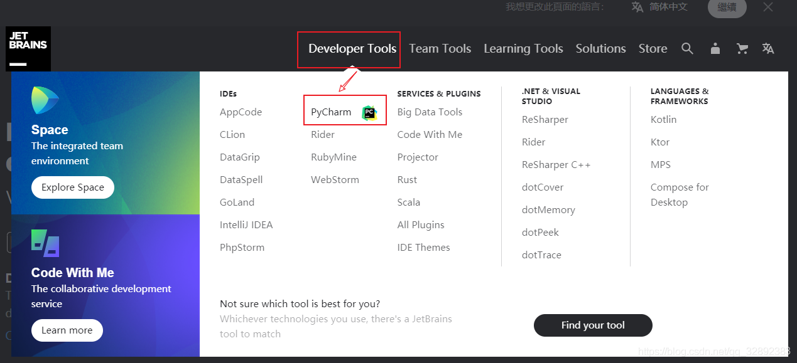
2. #### 选择版本（都可以）:

   **Community**（社区版，免费）
   **Professional**（专业版，收费）
   学生认证教程：https://lic.sjtu.edu.cn/Default/index
   
3. #### 开始安装:
   
   双击安装程序文本，根据向导开始安装，确保安装在自己找得到的目录
   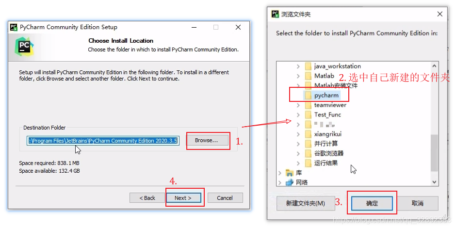
   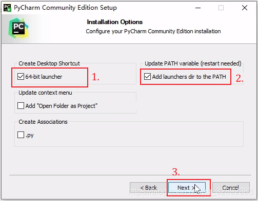
   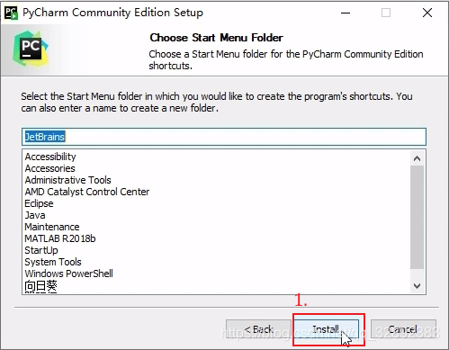

### 安装 Anaconda <a id="install anaconda"></a>

Anaconda 是一个免费且开源的 Python 和 R 语言的发行版。Anaconda附带了一大批常用的数据科学包，不需要使用pip进行下载；
自带的conda是包管理器和环境管理器，可以减少未来遇到的各种库和版本的问题。

#### 推荐安装教程：

https://blog.csdn.net/fan18317517352/article/details/123035625  
**注意**：如果按照上述链接中的指南操作，记得在这下面这两个步骤之间执行exit()命令，退出python环境
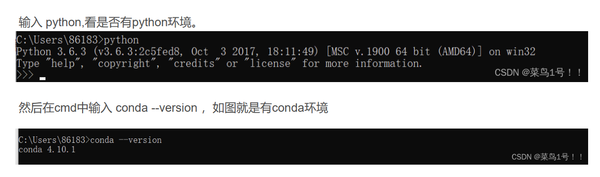

#### 创建虚拟环境

1. ##### 打开 Anaconda Prompt:
   
   在开始菜单中找到 Anaconda Prompt 并打开。

2. ##### 创建新的虚拟环境:
   
   使用以下命令创建一个新的虚拟环境，其中 `YourEnvName` 是你为虚拟环境选择的名称，`python=3.9` 指定了 Python 的版本。
   
   由于Pytorch只支持3.8-3.11的Python版本，请创建虚拟环境时的Python版本号。
   
   ```bash
   conda create -n YourEnvName python=3.9 -y
   
3. ##### 进入新创建的虚拟环境：
   ```bash
   conda activate YourEnvName
   
4. ##### 退出该虚拟环境：
   ```bash
   conda deactivate
   ```
   
5. ##### activate失败（感谢jcgg的贡献qwq）：

   在win11中，很有可能出现activate失败的情况。你可以通过一下两种方式排查。

   1. 首先确定conda已经添加到环境变量。

      对于Windows用户，根据采用的中终端，执行`conda init powershell`或`conda init cmd.exe`命令

      如果出现不能运行的脚本的问题，在管理员模式下打开 PowerShell，并输入以下命令来修改执行策略为 "RemoteSigned"（仅允许运行本地脚本）：`Set-ExecutionPolicy RemoteSigned`

      对于macos和linux用户，可以直接`conda init`

      最后，重新启动shell即可

   2. 如果这种方式失效，可以考虑手动添加虚拟环境到环境变量中

      首先找到你的anaconda的安装地址，打开其中的**envs**文件夹，能找到你创建的环境的文件夹。

      将需要activate的环境文件夹以及其内部的Scripts文件夹添加到环境变量中即可。

      

      

### 在Pycharm中使用Anaconda
1. 点击左上角"File"，点击"Open"，打开一个你的工作目录  
如果是初次使用：点击"Open"，打开一个你的工作目录   
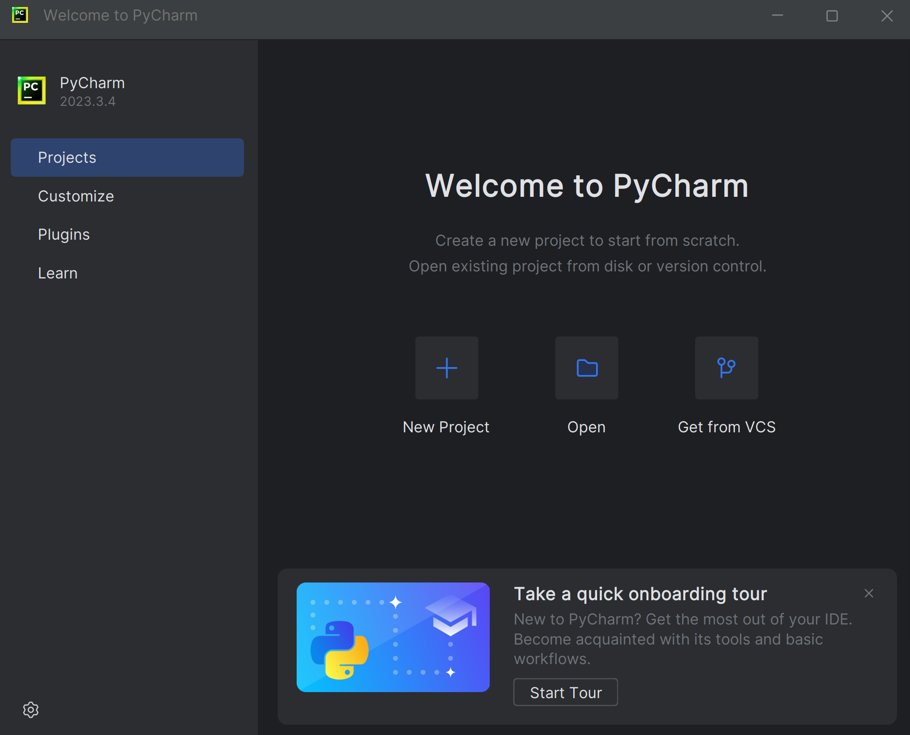

2. 点击"File"，点击"Settings"

    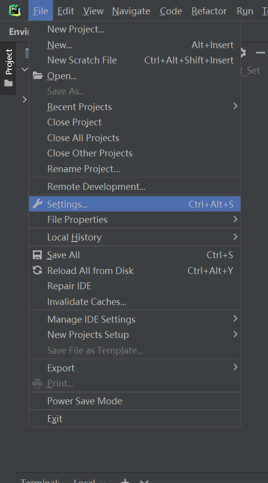  

3. 在"Project"里找到"Python Interpreter",点击"Add interpreter"  
    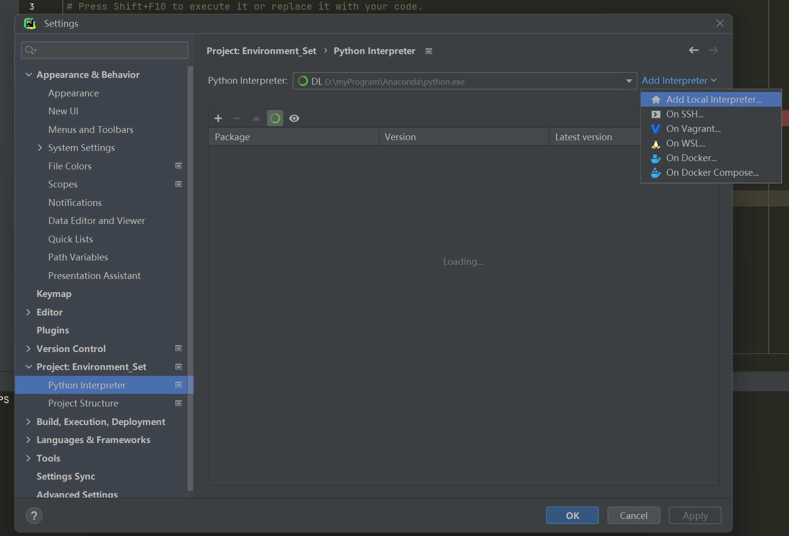  
4. 选择Conda Environment，点击文件夹图标浏览目录，找到自己Anaconda的安装目录  
    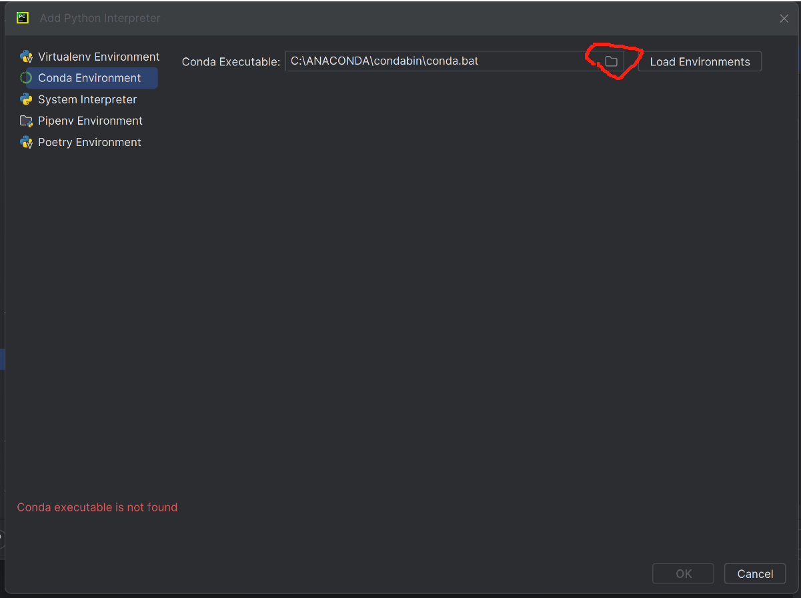  
5. 选择Conda Executable， 点击右边的“Load Environments”
    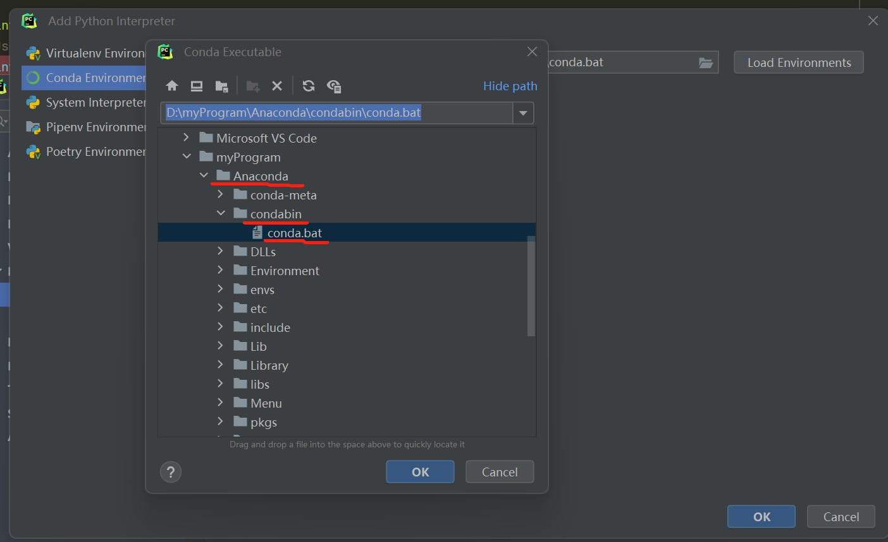  
6. 选择刚刚创建的虚拟环境"deepLearning"  
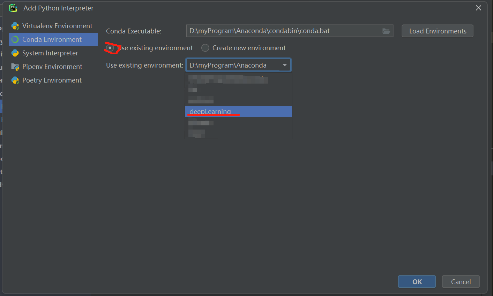  

或者，你也可以通过以下操作添加interpreter：

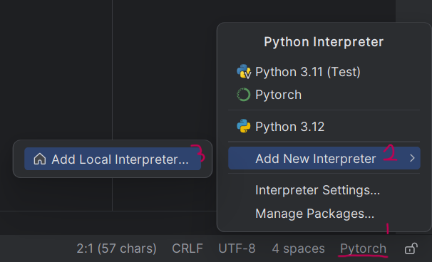

# 2. Vscode+Anaconda

### 在Vscode中使用Anaconda

1. 根据PyCharm+Anaconda“[安装Anaconda](#install anaconda)”步骤进行操作，配置Anaconda并创建虚拟环境
2. 在Vscode中打开一个目录，创建test.py文件，点击右下角的“选择解释器”
   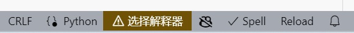  
     然后选择刚刚创建的conda虚拟环境的名字即可

# 3. 安装深度学习框架和其他库

### 1. 激活虚拟环境

激活虚拟环境以在环境中安装相关的库

   ```bash
   conda activate YourEnvName
   ```

你可以通过一下命令判断是否成功切换

``` bash
conda info -e
```

如果在你想激活的环境前有一个“*”，说明已经成功切换

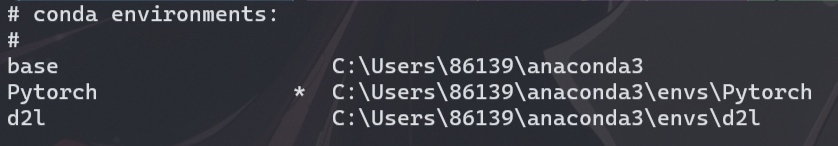

### 2. 安装依赖项

首先，切换目录到clone下来的仓库

接着，运行以下命令

``` bash
conda install cmake ninja
pip install -r requirements.txt
```

由于本次workshop无需用到**torch.distributed**中的内容，因此只安装了common dependencies。如果有需要，可以自行前往[Pytorch](https://github.com/pytorch/pytorch)的仓库进行查阅

### 3.安装深度学习框架

 #### For Windows

对于Windows用户，你需要根据自己的GPU选择对应的版本。

``` bash
# 如果你的GPU是NVIDIA系的，支持CUDA，你可以安装这个版本
# pip
pip3 install torch torchvision torchaudio --index-url https://download.pytorch.org/whl/cu121
# conda
conda install pytorch torchvision torchaudio pytorch-cuda=12.1 -c pytorch -c nvidia
```

``` bash
# 如果不是，你需要安装CPU版本
# pip
pip3 install torch torchvision torchaudio
# conda
conda install pytorch torchvision torchaudio cpuonly -c pytorch
```

对于workshop来说，CPU版本绰绰有余。

#### For Mac

``` bash
# pip
pip3 install torch torchvision torchaudio
# conda
conda install pytorch::pytorch torchvision torchaudio -c pytorch
```

### For Linux

与Windows类似，需要判断GPU

```bash
# 如果你的GPU是NVIDIA系的，支持CUDA，你可以安装这个版本
# pip
pip3 install torch torchvision torchaudio
# conda
conda install pytorch torchvision torchaudio pytorch-cuda=12.1 -c pytorch -c nvidia
```

``` bash
# 如果不是，你需要安装CPU版本
# pip
pip3 install torch torchvision torchaudio --index-url https://download.pytorch.org/whl/cpu
# conda
conda install pytorch torchvision torchaudio cpuonly -c pytorch
```

# 4. Google Colab

如果你选择使用Google Colab，你所需要的只是一个Google账号和一个梯子。

### 1. 使用Google Drive

进入[Google Drive](https://drive.google.com)官网，使用你的Google账号登录，你就获得了一个15GB的云空间。

### 2. 关联 Google Drive 和 Google Colab

首先，点击**我的云端硬盘**，右键点击，点击**更多**，点击**关联更多应用**


搜索**Google Colaboratory**，点击安装


最后，右键点击，点击**更多**，点击**Google Colaboratory**，你就创建了一个.ipynb文件并用Colab打开。其功能与Jupyter Notebook类似，不过支持对云端导入Google Drive文件和使用GPU（有限额）。

### 3. 连接GPU

一般情况下，Colab并不主动提供GPU资源。

你可以通过点击左上角**修改**，点击**笔记本设置**，申请使用GPU加速。

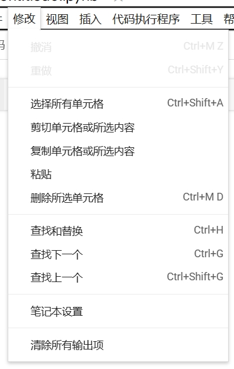

当然，GPU存在使用量上限。因此推荐在没有使用GPU时切换到标准运行时。

你可以通过输入以下命令，了解GPU情况：

``` python
! /opt/bin/nvidia-smi 
```

### 4. 导入Google Drive

由于虚拟机分配有时间限制，免费版最长运行12个小时，在终止运行之后，会造成数据的丢失。因此，我们通常会将文件和数据保存在Google Drive中。

而想要导入Google Drive中的文件，只需要执行以下命令

``` python
from google.colab import drive 
drive.mount('/content/drive/') 
```

登录之后就成功导入Google Drive中的文件。

你可以通过左侧边的**文件**选项查找到Google Drive中的文件。

### 5. 运行

直接输入代码并运行即可。

如果你只是想简单尝试一下，你也可以跳过步骤3和4，直接运行代码块。


# 参考资料

pycharm安装：https://blog.csdn.net/qq_32892383/article/details/116137730  

anaconda安装：https://blog.csdn.net/fan18317517352/article/details/123035625

Pytorch官网： https://pytorch.org

Pytorch仓库：https://github.com/pytorch/pytorch

