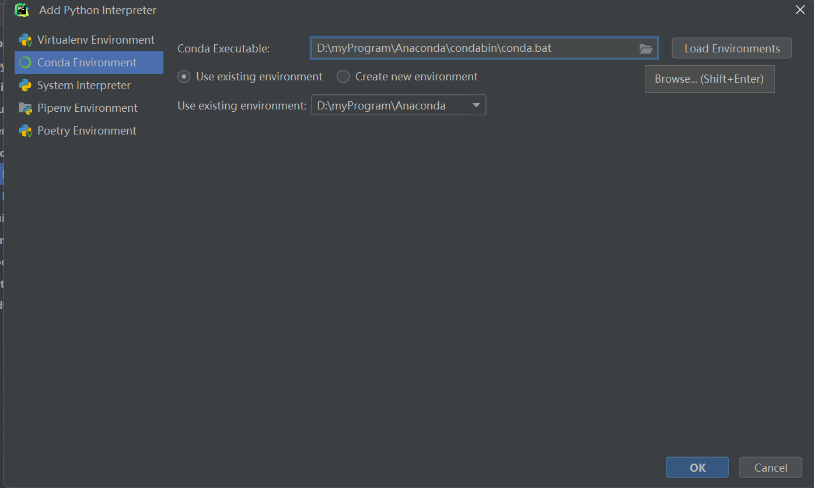

# 环境配置指南

## 安装 PyCharm

PyCharm 是由 JetBrains 开发的一款强大的 Python IDE。PyCharm 使用其自己的虚拟环境管理器，便于环境管理。

1. #### 访问 PyCharm 官网:
   
   访问 [PyCharm 官网](https://www.jetbrains.com/pycharm/download/) ，从“Developer Tools”一栏找到“PyCharm”，点击“Download”。

2. #### 选择版本（都可以）:

   **Community**（社区版，免费）
   **Professional**（专业版，收费）
   学生认证教程：https://lic.sjtu.edu.cn/Default/index
   

3. #### 开始安装:
   
   双击安装程序文本，根据向导开始安装，确保安装在自己找得到的目录


## 安装 Anaconda（非必须）

Anaconda 是一个免费且开源的 Python 和 R 语言的发行版。Anaconda附带了一大批常用的数据科学包，不需要使用pip进行下载；
自带的conda是包管理器和环境管理器，可以减少未来遇到的各种库和版本的问题。

### 推荐安装教程：
https://blog.csdn.net/fan18317517352/article/details/123035625

### 创建虚拟环境

1. #### 打开 Anaconda Prompt:
   
   在开始菜单中找到 Anaconda Prompt 并打开。

2. #### 创建新的虚拟环境:
   
   使用以下命令创建一个新的虚拟环境，其中 `deeplearning` 是你为虚拟环境选择的名称，`python=3.9` 指定了 Python 的版本。
   
   ```bash
   conda create -n deepLearning python=3.9

3. #### 进入新创建的虚拟环境：
   ```bash
   conda activate deepLearning
   
4. #### 退出该虚拟环境：
   ```bash
   conda deactivate

### 在Pycharm中使用Anaconda
1. 点击左上角File，点击Open，打开一个你的工作目录
2. 点击File，点击Settings

3. 在project里找到Python Interpreter,点击Add interpreter

4. 选择Conda Environment，点击文件夹图标浏览目录

5. 选择Conda Executable

6. 选择刚刚创建的虚拟环境deepLearning

   
## 参考资料
pycharm安装：https://blog.csdn.net/qq_32892383/article/details/116137730  

anaconda安装：https://blog.csdn.net/fan18317517352/article/details/123035625