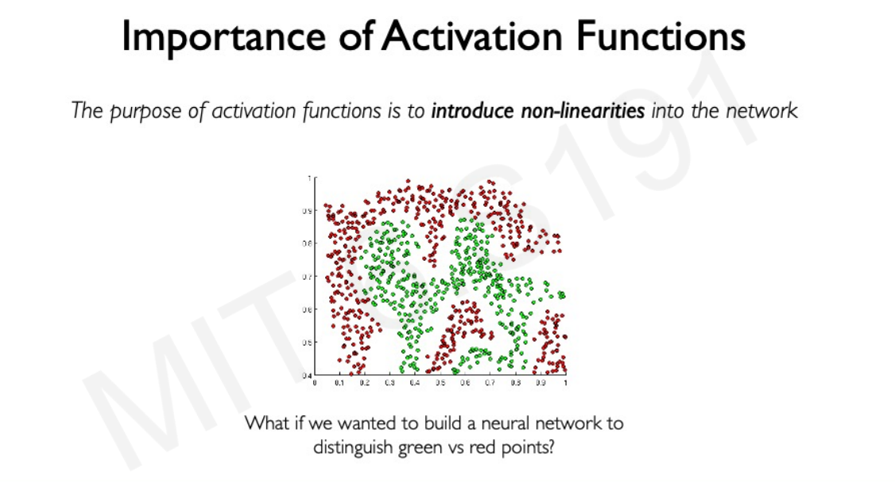
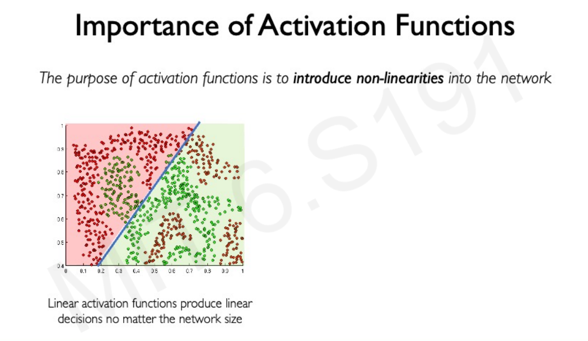
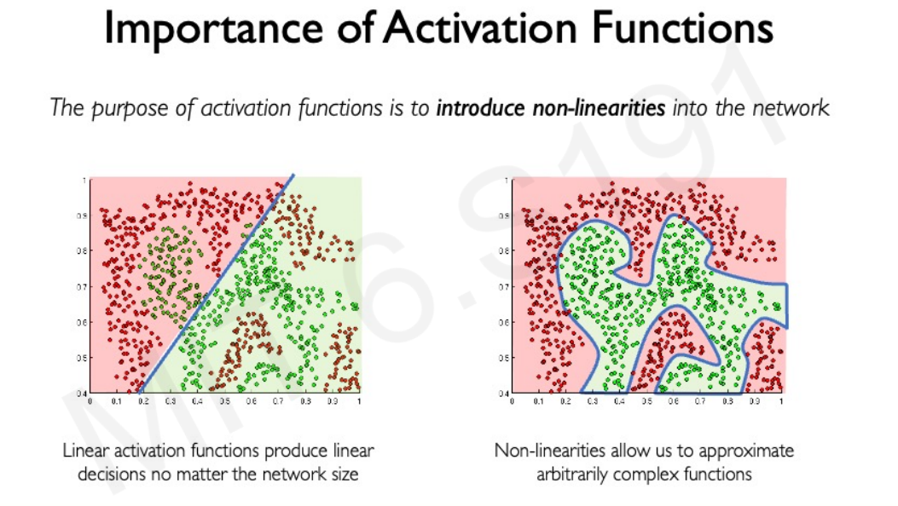

# DL Workshop 1

### 什么是[深度学习](https://easyai.tech/ai-definition/deep-learning/)
>深度学习是机器学习的一个分支，它模仿了人脑的**神经网络**结构，通过多层非线性变换，学习输入数据的特征表示，并最终在输出层进行预测。简单来说，深度学习，或者叫做神经网络，就是一个通过已知的输入和输出不断**调整参数**的机器学习模型。具体是怎样调整参数的呢，我们后面会讲到。

#### 人工智能，机器学习，深度学习

可以说深度学习是机器学习的一种技术，而机器学习则是实现人工智能的一种方法。深度学习通过构建更深层次的神经网络来实现对数据的学习和建模，是机器学习领域的一个重要分支，也是当前人工智能领域取得重大突破的主要技术之一。

#### 深度学习的基本单元——perceptron(感知器)

#### 简单理解深度学习

#### 4种典型深度学习算法

##### 1. 卷积神经网络[（CNN）](https://easyai.tech/ai-definition/cnn/)
> CNN是干什么的呢，简单来说，就是由于图片太大，普通的神经网络无法处理，所以就需要对它进行**特征提取**，这就是CNN中的C，convolution（卷积）的作用。

###### CNN 的价值：
1. 能够将大数据量的图片有效的降维成小数据量(并不影响结果)
2. 能够保留图片的特征，类似人类的视觉原理
###### CNN 的基本原理：

1. 卷积层 – 主要作用是保留图片的特征

2. 池化层 – 主要作用是把数据降维，可以有效的避免过拟合

3. 全连接层 – 根据不同任务输出我们想要的结果
###### CNN 的实际应用：
1. 图片分类、检索

2. 目标定位检测

3. 目标分割

4. 人脸识别

5. 骨骼识别

##### 2. 循环神经网络[（RNN）](https://easyai.tech/ai-definition/rnn/)
> RNN又是干什么的呢？对于之前的神经网络来说，本次的输出只与本次的输入有关，而RNN呢，则可以说是具有**记忆**的神经网络，之前的输入也会对本次的输出造成影响，就像GPT一样，不过GPT采用的架构并不是RNN，而是Transformer，这个我们后面再说。

##### 3. 生成对抗网络（GAN）
##### 4. 深度强化学习（LR）

### 深度学习的应用

### 搭建深度学习框架

##### 参考资料
[深度学习 – Deep learning | DL](https://easyai.tech/ai-definition/deep-learning/)

[深度学习(1): 深度学习简介](https://zhuanlan.zhihu.com/p/150646196)

[MIT 6.S191 Introduction to Deep Learning](http://introtodeeplearning.com/)

[深度学习入门与实战-卷积神经网络](https://www.u72.net/IT/show-108779.html)

[卷积神经网络 – CNN](https://easyai.tech/ai-definition/cnn/)

[循环神经网络 – Recurrent Neural Network | RNN](https://easyai.tech/ai-definition/rnn/)

