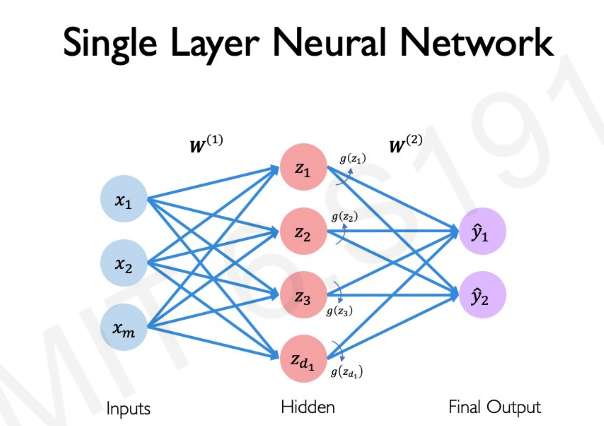

# Part 3

## Time for practice!

Part 3为MNIST演示。（手写数字识别）

在Workshop Files文件夹内，有一个练习文件`MNIST_playground.py`，用作实践。

在Part 3文件夹内，有两个文件：`MNISTNN.py`和`MNIST_CNN.py`，wksp上会讲解`MNIST_CNN.py`，一个引入卷积的版本。实践过程中，请自行写出`MNISTNN.py`的版本。

一些图片参考：

