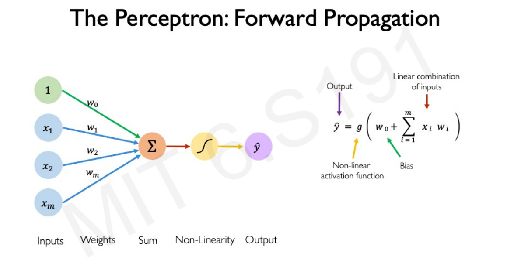
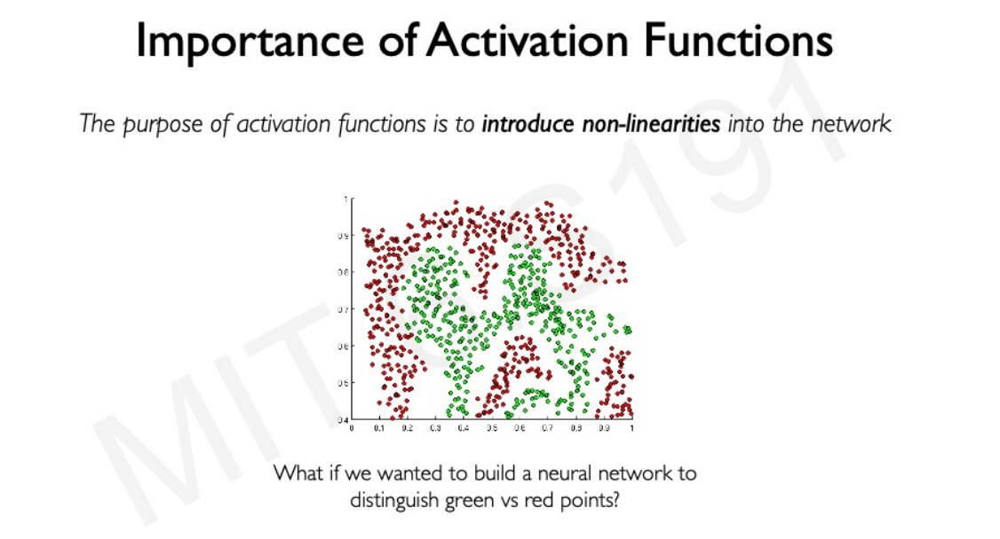
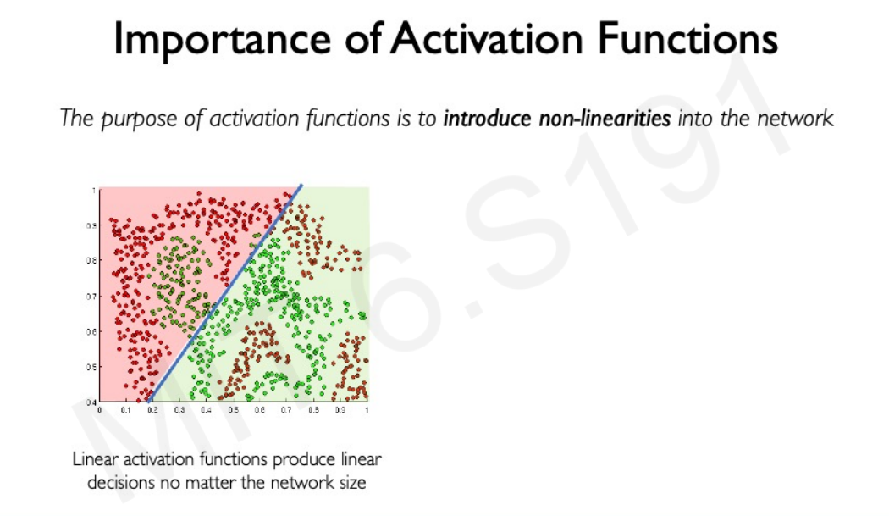
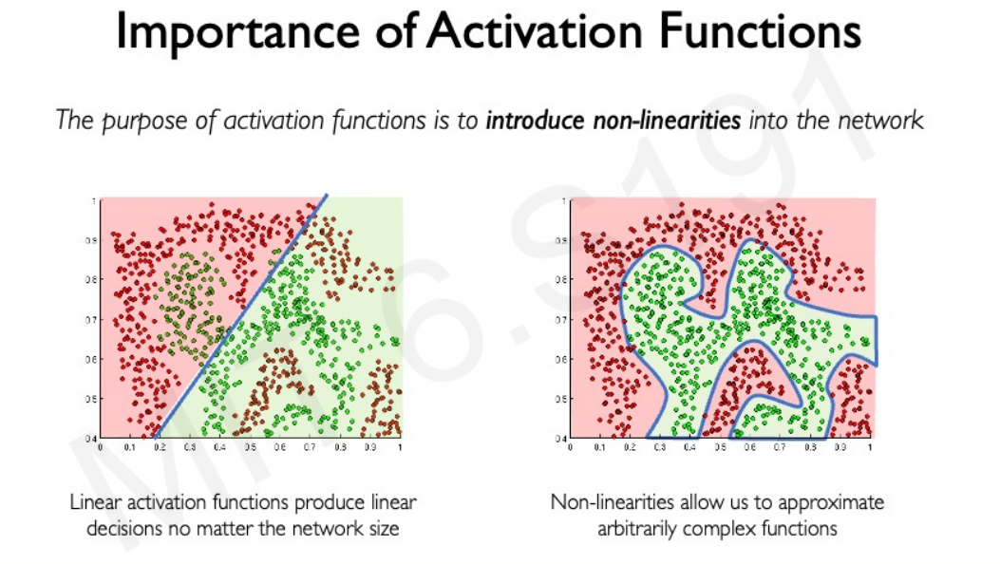

# DL Workshop 1

### 什么是[深度学习](https://easyai.tech/ai-definition/deep-learning/)

>深度学习是机器学习的一个分支，它模仿了人脑的**神经网络**结构，通过多层非线性变换，学习输入数据的特征表示，并最终在输出层进行预测。简单来说，深度学习，或者叫做神经网络，就是一个通过已知的输入和输出不断**调整参数**的机器学习模型。具体是怎样调整参数的呢，我们后面会讲到。

#### 人工智能，机器学习，深度学习


可以说深度学习是机器学习的一种技术，而机器学习则是实现人工智能的一种方法。深度学习通过构建更深层次的神经网络来实现对数据的学习和建模，是机器学习领域的一个重要分支，也是当前人工智能领域取得重大突破的主要技术之一。


#### 深度学习的基本单元——perceptron(感知器)

> 由输入得到输出。



那我们该怎样得到输出呢？由图可知，输出是输入的线性组合，加上一个偏置项，再加上一个激活函数，就构成了一个感知器。

##### 什么是激活函数

> 激活函数就是一个非线性函数，用来引入非线性因素，使得神经网络能够逼近任何非线性函数。





#### 简单理解深度学习

看了很多版本的解释，发现李开复在[《人工智能》](人工智能.pdf)一书中讲的是最容易理解的，所以下面直接引用他的解释：

我们以识别图片中的汉字为例。

假设深度学习要处理的信息是“水流”，而处理数据的深度学习网络是一个由管道和阀门组成的巨大水管网络。网络的入口是若干管道开口，网络的出口也是若干管道开口。这个水管网络有许多层，每一层由许多个可以控制水流流向与流量的调节阀。根据不同任务的需要，水管网络的层数、每层的调节阀数量可以有不同的变化组合。对复杂任务来说，调节阀的总数可以成千上万甚至更多。水管网络中，每一层的每个调节阀都通过水管与下一层的所有调节阀连接起来，组成一个从前到后，逐层完全连通的水流系统。


那么，计算机该如何使用这个庞大的水管网络来学习识字呢？

比如，当计算机看到一张写有“田”字的图片，就简单将组成这张图片的所有数字（在计算机里，图片的每个颜色点都是用“0”和“1”组成的数字来表示的）全都变成信息的水流，从入口灌进水管网络。


我们预先在水管网络的每个出口都插一块字牌，对应于每一个我们想让计算机认识的汉字。这时，因为输入的是“田”这个汉字，等水流流过整个水管网络，计算机就会跑到管道出口位置去看一看，是不是标记由“田”字的管道出口流出来的水流最多。如果是这样，就说明这个管道网络符合要求。如果不是这样，就调节水管网络里的每一个流量调节阀，让“田”字出口“流出”的水最多。

这下，计算机要忙一阵了，要调节那么多阀门！好在计算机的速度快，暴力的计算加上算法的优化，总是可以很快给出一个解决方案，调好所有阀门，让出口处的流量符合要求。


下一步，学习“申”字时，我们就用类似的方法，把每一张写有“申”字的图片变成一大堆数字组成的水流，灌进水管网络，看一看，是不是写有“申”字的那个管道出口流水最多，如果不是，我们还得再调整所有的阀门。这一次，要既保证刚才学过的“田”字不受影响，也要保证新的“申”字可以被正确处理。


如此反复进行，知道所有汉字对应的水流都可以按照期望的方式流过整个水管网络。这时，我们就说，这个水管网络是一个训练好的深度学习模型了。当大量汉字被这个管道网络处理，所有阀门都调节到位后，整套水管网络就可以用来识别汉字了。这时，我们可以把调节好的所有阀门都“焊死”，静候新的水流到来。


与训练时做的事情类似，未知的图片会被计算机转变成数据的水流，灌入训练好的水管网络。这时，计算机只要观察一下，哪个出水口流出来的水流最多，这张图片写的就是哪个字。

**深度学习大致就是这么一个用人类的数学知识与计算机算法构建起来的整体架构，再结合尽可能多的训练数据以及计算机的大规模运算能力去调节内部参数，尽可能逼近问题目标的半理论、半经验的建模方式。**

#### 4种典型深度学习算法


##### 1. 卷积神经网络[（CNN）](https://easyai.tech/ai-definition/cnn/)

> CNN是干什么的呢，简单来说，就是由于图片太大，普通的神经网络无法处理，所以就需要对它进行**特征提取**，这就是CNN中的C，convolution（卷积）的作用。


###### CNN 的价值：

1. 能够将大数据量的图片有效的降维成小数据量(并不影响结果)
2. 能够保留图片的特征，类似人类的视觉原理

###### CNN 的基本原理：

1. 卷积层 – 主要作用是保留图片的特征


2. 池化层 – 主要作用是把数据降维，可以有效的避免过拟合


3. 全连接层 – 根据不同任务输出我们想要的结果
###### CNN 的实际应用：
1. 图片分类、检索


2. 目标定位检测


3. 目标分割


4. 人脸识别


5. 骨骼识别


##### 2. 循环神经网络[（RNN）](https://easyai.tech/ai-definition/rnn/)

> RNN又是干什么的呢？对于之前的神经网络来说，本次的输出只与本次的输入有关，而RNN呢，则可以说是具有**记忆**的神经网络，之前的输入也会对本次的输出造成影响，就像GPT一样，不过GPT采用的架构并不是RNN，而是Transformer，这个我们后面再说。


可以看到，RNN的输入和输出之间是存在关联的，也就是说，RNN的输出是依赖于之前的输入的。


但这就出现了一个问题，什么呢？也就是越先前的输入对后来的输出的影响就越小，这就导致RNN没有办法拥有长时间的记忆。

##### 3. 生成对抗网络[（GAN）](https://zhuanlan.zhihu.com/p/33752313)

> GAN这个东西呢，有些复杂，我们就不详细地说明了。举个例子，GAN就像造假钞和验假钞的，当造假钞的技术提高后验假钞的技术也就需要提高，而验假钞的技术提高后，造假钞的就又要绞尽脑汁造得更真，GAN就是这样一个相互对抗的过程。


它是怎样的呢？GAN有一个生成器（generator）和一个判别器（discriminator），生成器呢，就是生成假的东西，判别器呢，就是判断真假的东西。生成器和判别器就像造假钞的和验假钞的，当同样数量的真钞和假钞被放在一起检验是，正确和错误的比例都是50%时，那么这个生成器就算训练成功了。（不要造假钞！！）

##### 4. 深度强化学习[（LR）](https://easyai.tech/ai-definition/reinforcement-learning/)

> LR是什么呢？我们继续说得简单一些。这是一个通过奖惩机制来纠正AI行为或者说是调整模型参数，来达到我们训练目的的一种方法。

<iframe 
height="500"
width="100%"
src="https://player.bilibili.com/player.html?bvid=BV1QY411k7oW&autoplay=False"
allowfullscreen="allowfullscreen" 
scrolling="no" 
frameborder="0" 
sandbox="allow-top-navigation allow-same-origin allow-forms allow-scripts">
</iframe>
强化学习算法的思路非常简单，以游戏为例，如果在游戏中采取某种策略可以取得较高的得分，那么就进一步「强化」这种策略，以期继续取得较好的结果。这种策略与日常生活中的各种「绩效奖励」非常类似。我们平时也常常用这样的策略来提高自己的游戏水平。

在 Flappy bird 这个游戏中，我们需要简单的点击操作来控制小鸟，躲过各种水管，飞的越远越好，因为飞的越远就能获得更高的积分奖励。

这就是一个典型的强化学习场景：

* 机器有一个明确的小鸟角色——代理
* 需要控制小鸟飞的更远——目标
* 整个游戏过程中需要躲避各种水管——环境
* 躲避水管的方法是让小鸟用力飞一下——行动
* 飞的越远，就会获得越多的积分——奖励


你会发现，强化学习和监督学习、无监督学习 最大的不同就是不需要大量的“数据喂养”。而是通过自己不停的尝试来学会某些技能。

### 一些库

- ##### [YOLO](https://github.com/ultralytics/ultralytics?tab=readme-ov-file)（计算机视觉）

<iframe 
height="400"
width="100%"
src="https://github.com/ultralytics/ultralytics"
allowfullscreen="allowfullscreen"  
frameborder="0" 
sandbox="allow-top-navigation allow-same-origin allow-forms allow-scripts">
</iframe>


- ##### [CVZone](https://github.com/cvzone/cvzone)（计算机视觉）

<iframe 
height="400"
width="100%"
src="https://github.com/cvzone/cvzone"
allowfullscreen="allowfullscreen" 
frameborder="0" 
sandbox="allow-top-navigation allow-same-origin allow-forms allow-scripts">
</iframe>


- ##### [NLTK](https://www.nltk.org/)（自然语言处理）

<iframe 
height="400"
width="100%"
src="https://www.nltk.org/"
allowfullscreen="allowfullscreen" 
frameborder="0" 
sandbox="allow-top-navigation allow-same-origin allow-forms allow-scripts">
</iframe>


- ##### [Gymnasium](https://github.com/Farama-Foundation/Gymnasium?tab=readme-ov-file)（强化学习）

  

### 小试牛刀

```python
# 安装ultralytics库
pip install ultralytics
```

##### 1. 图片分类（手写数字分类器）


> ######     MNIST介绍
> - MNIST 包含 60,000 张手写数字训练图像和 10,000 张测试图像。
> - 数据集由大小为 28x28 像素的灰度图像组成。
> - 对图像进行归一化处理，使其适合 28x28 像素的边界框，并进行抗锯齿处理，引入灰度级。
> - MNIST 广泛用于机器学习领域的训练和测试，尤其是图像分类任务。


###### 训练模型

```python
from ultralytics import YOLO

# Load a model
model = YOLO('yolov8n-cls.pt')  # load a pretrained model (recommended for training)

# Train the model
results = model.train(data='mnist', epochs=10, imgsz=32) # 从云端下载MNIST数据集
```

```python
# 如果你想要使用本地的数据集
from ultralytics import YOLO

# Load a model
model = YOLO('yolov8n-cls.pt')  # load a pretrained model (recommended for training)

# Train the model
results = model.train(data='path/to/dataset', epochs=100, imgsz=640)
```

```
# 目录结构

dataset/
|-- train/
|   |-- class1/
|		|-- img1.jpg
|   	|-- img2.jpg
|   	|-- ...
|	|-- class2/
|		|-- img1.jpg
|   	|-- img2.jpg
|   	|-- ...
|	|-- ...
|
|-- val/
|   |-- class1/
|		|-- img1.jpg
|   	|-- img2.jpg
|   	|-- ...
|	|-- class2/
|		|-- img1.jpg
|   	|-- img2.jpg
|   	|-- ...
|	|-- ...
```

###### 验证模型

```python
from ultralytics import YOLO

# Load a model
model = YOLO('yolov8n-cls.pt')  # load an official model
model = YOLO('path/to/best.pt')  # load a custom model

# Validate the model
metrics = model.val()  # no arguments needed, dataset and settings remembered
metrics.top1   # top1 accuracy
metrics.top5   # top5 accuracy
```

###### 进行预测

```python
from ultralytics import YOLO

# Load a model
model = YOLO('yolov8n-cls.pt')  # load an official model
model = YOLO('path/to/best.pt')  # load a custom model

# Predict with the model
results = model('https://ultralytics.com/images/bus.jpg')  # predict on an image
```

##### 2. 目标检测


###### 教程

[IMAGE CLASSIFICATION with Yolov8 custom dataset | Computer vision tutorial (youtube.com)](https://www.youtube.com/watch?v=ZeLg5rxLGLg)

###### 演示

```python
# 安装PIL库（进行图像处理的）
pip install Pillow
```

```python
from PIL import Image
from ultralytics import YOLO

# Load a pretrained YOLOv8n model
model = YOLO('yolov8n.pt')

# Define remote image or video URL
source = 'https://ultralytics.com/images/bus.jpg'

# Run inference on the source
results = model(source)  # list of Results objects

# Visualize the results
for i, r in enumerate(results):
    # Plot results image
    im_bgr = r.plot()  # BGR-order numpy array
    im_rgb = Image.fromarray(im_bgr[..., ::-1])  # RGB-order PIL image

    # Show results to screen (in supported environments)
    r.show()

    # Save results to disk
    r.save(filename=f'results{i}.jpg')
```

##### 相关资料

[Deep Learning](https://github.com/exacity/deeplearningbook-chinese?tab=readme-ov-file)

[DIVE INTO DEEP LEARNING](https://zh.d2l.ai/chapter_preface/index.html)

[Banyutong/deep_learning_hands_on (github.com)](https://github.com/Banyutong/deep_learning_hands_on)

##### 参考资料

[深度学习 – Deep learning | DL](https://easyai.tech/ai-definition/deep-learning/)

[《人工智能》](人工智能.pdf)

[深度学习(1): 深度学习简介](https://zhuanlan.zhihu.com/p/150646196)

[MIT 6.S191 Introduction to Deep Learning](http://introtodeeplearning.com/)

[深度学习入门与实战-卷积神经网络](https://www.u72.net/IT/show-108779.html)

[卷积神经网络 – CNN](https://easyai.tech/ai-definition/cnn/)

[循环神经网络 – Recurrent Neural Network | RNN](https://easyai.tech/ai-definition/rnn/)

[通俗理解生成对抗网络GAN](https://zhuanlan.zhihu.com/p/33752313)

[强化学习-Reinforcement learning | RL](https://easyai.tech/ai-definition/reinforcement-learning/)

[Deep Reinforcement Learning with OpenAI Gym in Python](https://www.youtube.com/watch?v=YLa_KkehvGw)

[MNIST](http://yann.lecun.com/exdb/mnist/)
